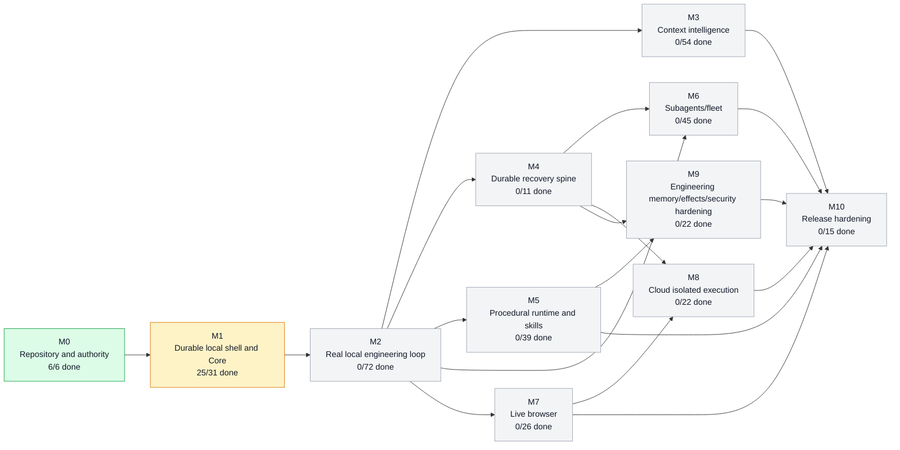
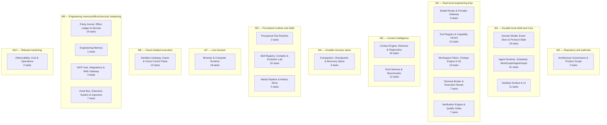
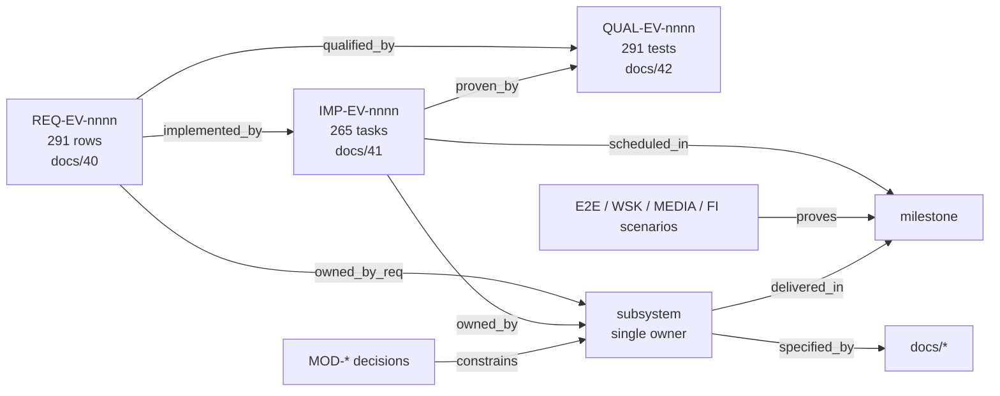

# Modbit Project Graph

> Generated from `graph/project-graph.json` by `tools/graph.py render --write`. Do not edit by hand; edit the graph through `tools/graph.py set` or regenerate structure with `tools/build_graph.py`.  
> Graph generated on 2026-09-04; view rendered on 2026-09-04.

## What the graph is

One JSON file that answers *what exists, what depends on what, what proves what, and what state each work item is in*. Node and edge types:

| Node type | Count | Meaning |
|---|---:|---|
| `section` | 8 | numbering range of the dossier |
| `doc` | 70 | one specification file in docs/ |
| `milestone` | 11 | M0–M10 from docs/43; carries proof statement and dependency edges |
| `milestone_task` | 78 | Mx.y row from docs/43 (plus five tasks the V2 sequencing delta named but did not enumerate); ordered inside its milestone; carries status |
| `subsystem` | 23 | canonical single-owner boundary (docs/81); owns REQ rows and IMP tasks; delivered in a primary milestone |
| `requirement` | 291 | REQ-EV-nnnn row from docs/40 with disposition and mandatory behavior |
| `imp_task` | 265 | IMP-EV-nnnn task from docs/41; carries status and evidence |
| `qual_test` | 291 | QUAL-EV-nnnn qualification from docs/42 |
| `scenario` | 77 | E2E-nnn, WSK-E2E-nnn, MEDIA-E2E-nnn release-gate scenario or FI-nn fault case |
| `decision` | 38 | MOD-* decision from docs/02 with LOCKED/PROVISIONAL/EXPERIMENT/DEFERRED/REJECTED status |

| Edge type | Count | Meaning |
|---|---:|---|
| `in_section` | 70 | doc → section |
| `references` | 115 | doc → doc (explicit filename mention) |
| `depends_on` | 18 | milestone → milestone it requires COMPLETE first |
| `part_of` | 78 | milestone_task → milestone |
| `after` | 67 | milestone_task → previous milestone_task in the same milestone (execution order) |
| `delivered_in` | 22 | subsystem → primary milestone |
| `specified_by` | 35 | subsystem → doc |
| `owned_by_req` | 291 | requirement → subsystem |
| `owned_by` | 265 | imp_task → subsystem |
| `scheduled_in` | 265 | imp_task → milestone |
| `implemented_by` | 265 | requirement → imp_task |
| `qualified_by` | 291 | requirement → qual_test |
| `proven_by` | 265 | imp_task → qual_test |
| `proves` | 77 | scenario → milestone |
| `constrains` | 38 | decision → subsystem |

## Milestone dependency graph (live status)



Critical path (reliability spine): **M0 → M1 → M2 → M4**. Do not start broad multi-agent or cloud work before the single-agent durable local loop is E2E proven.

## Milestone roll-up

| Milestone | State | Unblocked | Milestone tasks | IMP-EV tasks | Complete | Blocked | Depends on | Proof |
|---|---|---|---:|---:|---:|---:|---|---|
| M0 Repository and authority | COMPLETE | yes | 4 | 2 | 6 | 0 | — | clean clone build + architecture lint |
| M1 Durable local shell and Core | IN_PROGRESS | yes | 5 | 26 | 25 | 0 | M0 | user creates durable task, kills/restarts app/Core, same task recovers with no fake state. |
| M2 Real local engineering loop | NOT_STARTED | no | 10 | 62 | 0 | 0 | M1 | E2E-001/002/003 with live model and actual test pass. |
| M3 Context intelligence | NOT_STARTED | no | 9 | 45 | 0 | 0 | M2 | profile A/B/C benchmark plus retrieval-before-edit visible in task evidence. |
| M4 Durable recovery spine | NOT_STARTED | no | 6 | 5 | 0 | 0 | M2 | E2E-004/005/006/007/008. |
| M5 Procedural runtime and skills | NOT_STARTED | no | 7 | 32 | 0 | 0 | M2 | E2E-011/012; direct and procedural mode yield equivalent receipts/policy behavior. |
| M6 Subagents/fleet | NOT_STARTED | no | 7 | 38 | 0 | 0 | M2, M4 | E2E-009/010 and user can supervise multiple tasks without raw-log polling. |
| M7 Live browser | NOT_STARTED | no | 8 | 18 | 0 | 0 | M2 | E2E-013..016. |
| M8 Cloud isolated execution | NOT_STARTED | no | 9 | 13 | 0 | 0 | M4, M7 | E2E-017/018/024. |
| M9 Engineering memory/effects/security hardening | NOT_STARTED | no | 6 | 16 | 0 | 0 | M4, M5 | memory cannot be created from transcript without promotion; receipt chain verifies; threat tests pass. |
| M10 Release hardening | NOT_STARTED | no | 7 | 8 | 0 | 0 | M3, M5, M6, M7, M8, M9 | full Release Zero proof + package evidence |

## Subsystems → milestones

Each canonical subsystem is a single-owner boundary (`docs/81_ARCHITECTURE_GUARDRAILS_AND_FORBIDDEN_DUPLICATION.md`). The milestone shown is where the bulk of its `IMP-EV-*` tasks are scheduled; individual tasks may be scheduled elsewhere.



| Subsystem | Primary milestone | Crates / apps | Spec docs | REQ rows | IMP tasks | Decisions |
|---|---|---|---|---:|---:|---|
| `automation` Automation / Scheduling (DEFERRED) | — | — | `02` | 2 | 0 | MOD-MOBILE-001, MOD-AUTO-001 |
| `browser` Browser & Computer Runtime | M7 | `crates/browser` | `22` | 18 | 18 | MOD-BROWSE-001 |
| `context-engine` Context Engine, Retrieval & Diagnostics | M3 | `crates/context`, `crates/retrieval`, `crates/diagnostics` | `18` | 43 | 40 | MOD-CTX-001, MOD-CTX-002, MOD-EMB-001, MOD-CTX-003 |
| `core-runtime` Agent Runtime, Scheduler, WorkGraph/AgentGraph | M1 | `crates/core-runtime` | `14` | 44 | 41 | MOD-CORE-001, MOD-AGENT-001, MOD-ORCH-001, MOD-INPUT-001 |
| `desktop` Desktop Surface & UI | M1 | `apps/desktop`, `packages/ui`, `packages/surface-protocol`, `packages/design-tokens` | `10`, `32` | 11 | 11 | MOD-SURF-001, MOD-SURF-002, MOD-UX-001, MOD-DESK-001 |
| `domain-events` Domain Model, Event Store & Protocol State | M1 | `crates/domain`, `crates/protocol`, `crates/event-store`, `crates/protocol-state` | `13`, `30`, `31` | 23 | 19 | — |
| `durability` Compaction, Checkpoints & Recovery Spine | M4 | `crates/compaction`, `crates/checkpoint` | `19` | 4 | 4 | MOD-STATE-001, MOD-STATE-002, MOD-STATE-003 |
| `effects-security` Policy Kernel, Effect Ledger & Secrets | M9 | `crates/policy`, `crates/effects`, `crates/secrets` | `23`, `52` | 17 | 16 | MOD-EFFECT-001 |
| `eval-bench` Eval Harness & Benchmarks | M3 | `benchmarks/retrieval`, `benchmarks/context-economics`, `benchmarks/agent-engineering`, `benchmarks/latency` | `53` | 15 | 12 | MOD-JIT-001 |
| `extensions-hooks` Hook Bus, Extension System & Importers | M9 | `crates/tools (hooks)`, `crates/skills (import)` | `25` | 8 | 7 | — |
| `external-tools` MCP Hub, Integrations & Web Gateway | M9 | `crates/tools (external.*)` | `16` | 5 | 4 | — |
| `governance` Architecture Governance & Product Scope | M0 | `tools/architecture-lint`, `tools/evidence-check`, `docs/decisions` | `02`, `03`, `81`, `82` | 8 | 2 | MOD-PROD-001, MOD-IDE-001, MOD-IDE-002, MOD-COV-001 |
| `media` Media Pipeline & Artifact Store | M5 | `crates/tools (media)`, `object store` | `25` | 5 | 5 | MOD-MEDIA-001, MOD-MEDIA-002, MOD-MM-001 |
| `memory` Engineering Memory | M9 | `crates/memory` | `19` | 1 | 1 | — |
| `model-gateway` Model Router & Provider Gateway | M2 | `crates/providers` | `15` | 6 | 6 | — |
| `observability` Observability, Cost & Operations | M10 | `crates/observability` | `34`, `71` | 5 | 4 | — |
| `procedural-runtime` Procedural Tool Runtime | M5 | `crates/procedural-runtime` | `16` | 2 | 2 | — |
| `sandbox-cloud` Sandbox Gateway, Guest & Cloud Control Plane | M8 | `crates/sandbox`, `apps/cloud-api`, `apps/cloud-worker`, `apps/sandbox-gateway`, `services/modbit-guest` | `21`, `24` | 14 | 13 | MOD-SBX-001, MOD-AUTH-001, MOD-CLOUD-001 |
| `skills` Skill Registry, Compiler & Evolution Lab | M5 | `crates/skills`, `crates/prompt-compiler` | `26` | 20 | 20 | MOD-SKILL-001, MOD-SKILL-002 |
| `terminal` Terminal Broker & Execution Router | M2 | `crates/terminal`, `services/modbit-execd` | `21` | 7 | 7 | MOD-EXEC-001, MOD-EXEC-002 |
| `tool-runtime` Tool Registry & Capability Kernel | M2 | `crates/tools`, `crates/policy` | `16`, `17` | 10 | 10 | MOD-TOOL-001, MOD-TOOL-002, MOD-TOOL-003 |
| `verification` Verification Engine & Quality Gates | M2 | `crates/verification`, `tools/release-gate` | `50`, `51`, `83` | 7 | 7 | MOD-VERIFY-001 |
| `workspace-git` Workspace Fabric, Change Engine & Git | M2 | `crates/workspace`, `crates/git` | `20` | 16 | 16 | — |

## Requirement → task → test chain



Disposition counts: ADAPT 63, ADOPT 189, ALREADY COVERED 11, DEFERRED 9, EXPERIMENT 13, REJECT 6.

## Milestone tasks in execution order

### M0 — Repository and authority

| Task | Status | Title | Acceptance / note |
|---|---|---|---|
| `M0.1` | COMPLETE | Create monorepo, Rust workspace, pnpm workspace, CI, architecture-lint | fresh clone builds on macOS/Linux/Windows CI; forbidden dependency test works. |
| `M0.2` | COMPLETE | Add authoritative ADRs and status ledger | CI rejects changed locked architecture file without linked ADR metadata. |
| `M0.3` | COMPLETE | Protobuf domain/protocol generation Rust↔TS | round-trip compatibility tests. |
| `M0.4` | COMPLETE | Requirement-coverage CI and REQ→IMP→QUAL traceability parser | CI fails on ADOPT/ADAPT row without owner/IMP-EV/QUAL-EV, COMPLETE task without evidence, or duplicate active owner |

### M1 — Durable local shell and Core

| Task | Status | Title | Acceptance / note |
|---|---|---|---|
| `M1.1` | COMPLETE | Implement Session/Task/Run/Turn/RunStep domain and event store |  |
| `M1.2` | COMPLETE | Implement SQLite migrations, projections, command idempotency |  |
| `M1.3` | COMPLETE | Implement local authenticated SurfaceProtocol |  |
| `M1.4` | COMPLETE | Electron shell + real Fleet/New Task UI against Core |  |
| `M1.5` | COMPLETE | Crash/restart snapshot + event replay |  |

### M2 — Real local engineering loop

| Task | Status | Title | Acceptance / note |
|---|---|---|---|
| `M2.1` | NOT_STARTED | Workspace File Service with safe paths/revisions |  |
| `M2.2` | NOT_STARTED | Git branch/worktree/diff operations |  |
| `M2.3` | NOT_STARTED | `modbit-execd` structured argv/PTy/replay/OutputRef |  |
| `M2.4` | NOT_STARTED | Tool Registry + direct `fs/git/shell/test` tools |  |
| `M2.5` | NOT_STARTED | Capability Kernel + basic approval flow |  |
| `M2.6` | NOT_STARTED | Provider Gateway OpenAI + Anthropic streaming |  |
| `M2.7` | NOT_STARTED | Basic Prompt Compiler and one-agent runtime |  |
| `M2.8` | NOT_STARTED | Verification engine build/test checks |  |
| `M2.9` | NOT_STARTED | Trusted Code Review Surface |  |
| `M2.10` | NOT_STARTED | MediaEnvelope + Media Pipeline (before any multimodal provider/tool feature) | real PNG/JPEG/text-PDF read through fs.read with provenance, budgets and artifact digests |

### M3 — Context intelligence

| Task | Status | Title | Acceptance / note |
|---|---|---|---|
| `M3.1` | NOT_STARTED | exact/regex/path index |  |
| `M3.2` | NOT_STARTED | Tantivy BM25 |  |
| `M3.3` | NOT_STARTED | tree-sitter AST/symbol index |  |
| `M3.4` | NOT_STARTED | headless LSP diagnostics/symbol bridge |  |
| `M3.5` | NOT_STARTED | USearch embeddings + changed-chunk incremental update |  |
| `M3.6` | NOT_STARTED | dependency/Git/test/runtime evidence graph |  |
| `M3.7` | NOT_STARTED | L0-L3 retrieval planner + fusion |  |
| `M3.8` | NOT_STARTED | Context Pack/token budget/provenance ledger |  |
| `M3.9` | NOT_STARTED | retrieval benchmark harness |  |

### M4 — Durable recovery spine

| Task | Status | Title | Acceptance / note |
|---|---|---|---|
| `M4.1` | NOT_STARTED | Protocol State store |  |
| `M4.2` | NOT_STARTED | Compaction epochs + async worker + stale rejection + sync fallback |  |
| `M4.3` | NOT_STARTED | Workspace checkpoint baseline/delta objects + epoch fencing |  |
| `M4.4` | NOT_STARTED | kernel lease/session fencing |  |
| `M4.5` | NOT_STARTED | terminal/browser/sandbox cursor metadata interfaces |  |
| `M4.6` | NOT_STARTED | kill-point recovery suite |  |

### M5 — Procedural runtime and skills

| Task | Status | Title | Acceptance / note |
|---|---|---|---|
| `M5.1` | NOT_STARTED | Dynamic task-scoped tool projection |  |
| `M5.2` | NOT_STARTED | embedded QuickJS isolate with no ambient authority |  |
| `M5.3` | NOT_STARTED | generated `tools.*` bindings routed through normal Tool Registry |  |
| `M5.4` | NOT_STARTED | exec/wait/request_user_input surface |  |
| `M5.5` | NOT_STARTED | skill manifest/selector/compiler, provenance and signing |  |
| `M5.6` | NOT_STARTED | tool-schema/token-economics benchmark |  |
| `M5.7` | NOT_STARTED | Skill Evolution Lab as shadow/EXPERIMENT behind Skill Registry + Eval Harness | WSK-E2E-001..010; candidate cannot self-promote; production recovery independent of lab data |

### M6 — Subagents/fleet

| Task | Status | Title | Acceptance / note |
|---|---|---|---|
| `M6.1` | NOT_STARTED | WorkGraph/AgentGraph projections |  |
| `M6.2` | NOT_STARTED | capacity ticket allocator |  |
| `M6.3` | NOT_STARTED | transactional subagent admission |  |
| `M6.4` | NOT_STARTED | semantic write-conflict detector |  |
| `M6.5` | NOT_STARTED | subagent result/evidence handoff |  |
| `M6.6` | NOT_STARTED | attention-first Fleet states/UI |  |
| `M6.7` | NOT_STARTED | Durable subagent continuation (background child survives restart) | kill Core mid-child run; child identity, lineage, event offsets and result envelope survive |

### M7 — Live browser

| Task | Status | Title | Acceptance / note |
|---|---|---|---|
| `M7.1` | NOT_STARTED | local sandboxed WebContents session + CDP bridge |  |
| `M7.2` | NOT_STARTED | AX/DOM/layout semantic entities and stable IDs |  |
| `M7.3` | NOT_STARTED | state fingerprints + delta stream |  |
| `M7.4` | NOT_STARTED | semantic actions and postconditions |  |
| `M7.5` | NOT_STARTED | targeted screenshot/vision fallback |  |
| `M7.6` | NOT_STARTED | control lease/takeover |  |
| `M7.7` | NOT_STARTED | prompt-injection provenance isolation |  |
| `M7.8` | NOT_STARTED | credential handle fill path |  |

### M8 — Cloud isolated execution

| Task | Status | Title | Acceptance / note |
|---|---|---|---|
| `M8.1` | NOT_STARTED | Cloud API/Postgres/object store |  |
| `M8.2` | NOT_STARTED | cloud session kernel lease + worker |  |
| `M8.3` | NOT_STARTED | Sandbox Gateway + sandbox substrate adapter |  |
| `M8.4` | NOT_STARTED | signed/versioned `modbit-guest` |  |
| `M8.5` | NOT_STARTED | typed guest process/fs/PTy RPC |  |
| `M8.6` | NOT_STARTED | credential broker + egress policy |  |
| `M8.7` | NOT_STARTED | local→cloud checkpoint handoff |  |
| `M8.8` | NOT_STARTED | cloud browser remote stream/CDP |  |
| `M8.9` | NOT_STARTED | sandbox-loss recovery |  |

### M9 — Engineering memory/effects/security hardening

| Task | Status | Title | Acceptance / note |
|---|---|---|---|
| `M9.1` | NOT_STARTED | Engineering Memory schemas/scopes/promotion |  |
| `M9.2` | NOT_STARTED | protected-effect receipt hash chain |  |
| `M9.3` | NOT_STARTED | full protected-path/secret redaction/broker hardening |  |
| `M9.4` | NOT_STARTED | external MCP gateway |  |
| `M9.5` | NOT_STARTED | emergency stop |  |
| `M9.6` | NOT_STARTED | security fuzz/property/attack suites |  |

### M10 — Release hardening

| Task | Status | Title | Acceptance / note |
|---|---|---|---|
| `M10.1` | NOT_STARTED | telemetry/cost/SLO dashboards |  |
| `M10.2` | NOT_STARTED | updater/signing/SBOM |  |
| `M10.3` | NOT_STARTED | full RC E2E catalog |  |
| `M10.4` | NOT_STARTED | performance regression gates |  |
| `M10.5` | NOT_STARTED | docs/runbooks/support diagnostics |  |
| `M10.6` | NOT_STARTED | Release Zero scenario |  |
| `M10.7` | NOT_STARTED | Canonical tool and capability conformance harness | every production tool family passes its real-substrate conformance suite; no canned success |

## Proof scenarios by milestone

| Milestone | Scenarios |
|---|---|
| M0 | — |
| M1 | — |
| M2 | E2E-001, E2E-002, E2E-003, E2E-019, E2E-020, E2E-021, E2E-022, FI-11, FI-12 |
| M3 | FI-24 |
| M4 | E2E-004, E2E-005, E2E-006, E2E-007, E2E-008, FI-01, FI-02, FI-03, FI-04, FI-05, FI-06, FI-07, FI-08, FI-09, FI-10, FI-16, FI-19, FI-20, FI-21, FI-27, FI-28, FI-29 |
| M5 | E2E-011, E2E-012, MEDIA-E2E-001, MEDIA-E2E-002, MEDIA-E2E-003, MEDIA-E2E-004, MEDIA-E2E-005, MEDIA-E2E-006, MEDIA-E2E-007, MEDIA-E2E-008, MEDIA-E2E-009, MEDIA-E2E-010, MEDIA-E2E-011, MEDIA-E2E-012, WSK-E2E-001, WSK-E2E-002, WSK-E2E-003, WSK-E2E-004, WSK-E2E-005, WSK-E2E-006, WSK-E2E-007, WSK-E2E-008, WSK-E2E-009, WSK-E2E-010 |
| M6 | E2E-009, E2E-010, FI-22, FI-23 |
| M7 | E2E-013, E2E-014, E2E-015, E2E-016, FI-13, FI-14, FI-15 |
| M8 | E2E-017, E2E-018, E2E-024, FI-17, FI-18, FI-30 |
| M9 | E2E-023, FI-25, FI-26 |
| M10 | E2E-025 |

## Document map

| Section | Documents |
|---|---|
| Authority and orientation | `00`, `01`, `02`, `03`, `04` |
| Architecture and subsystems | `10`, `11`, `12`, `13`, `14`, `15`, `16`, `17`, `18`, `19`, `20`, `21`, `22`, `23`, `24`, `25`, `26` |
| Implementation specifications | `30`, `31`, `32`, `33`, `34`, `35`, `36`, `37` |
| Requirements, tasks and traceability | `40`, `41`, `42`, `43`, `44`, `45`, `46`, `47`, `48` |
| Verification and testing | `50`, `51`, `52`, `53`, `54`, `55`, `56`, `57`, `58`, `59`, `60` |
| Delivery and operations | `70`, `71`, `72`, `73`, `74` |
| Agent process and governance | `80`, `81`, `82`, `83`, `84`, `85`, `86`, `87`, `88`, `89`, `90`, `91`, `92`, `93` |
| Live state | `98` |

## Query cookbook

```bash
python3 tools/graph.py ready              # what can be started now (respects milestone + task ordering)
python3 tools/graph.py ready --all        # include tasks in blocked milestones
python3 tools/graph.py show IMP-EV-0013   # a task with its REQ, QUAL, subsystem, milestone, docs
python3 tools/graph.py show core-runtime  # a subsystem with everything it owns
python3 tools/graph.py set M1.1 AUDITING --agent agent-7
python3 tools/graph.py set M1.1 COMPLETE --evidence run:2026-09-20/e2e-003 --evidence commit:deadbeef
python3 tools/graph.py status             # milestone roll-up for docs/98_BUILD_MANIFEST.md
python3 tools/graph.py path               # topological milestone order and critical path
python3 tools/graph.py render --write     # refresh this file
python3 tools/check_dossier.py            # integrity gate (run before every handoff)
```

With `jq`:

```bash
jq '.nodes[] | select(.type=="imp_task" and .status!="NOT_STARTED") | {id,status,owner_agent}' graph/project-graph.json
jq -r '.edges[] | select(.type=="owned_by" and .to=="browser") | .from' graph/project-graph.json
```
